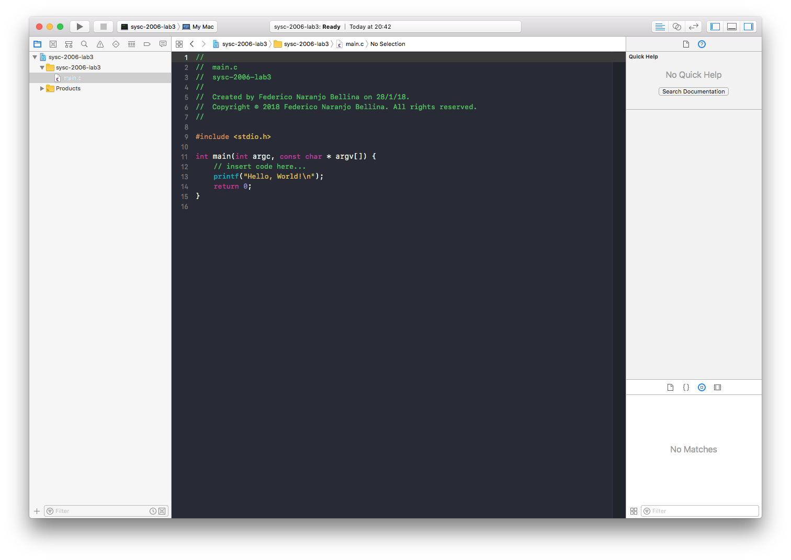

# How to Create a Command Line Application in Xcode

This tutorial will walk you through how you can create your own simple command line application on macOS, using **Xcode**. I am writing this specifially for students learning how to program with Macs but their professors insist on only using some sub-par free windows IDE. [ Ecor 1606 and Sysc 2006]

## Installing Xcode

In order to install Xcode, you must first download it from the <a href="https://itunes.apple.com/ca/app/xcode/id497799835?mt=12">App Store</a>. It's a large 5.5 GB file so start the download and go grab a cup of coffee. Once it's done downloading you can the app; you will get a license agreement, press accept.

## Creating Your First Project

Once you start Xcode you should get a welcome screen. If this window does not appear, or you closed it accidentally, you can press <kbd>cmd</kbd> + <kbd>shift</kbd> + <kbd>1</kbd>. Also, you can open it through the menubar option: **Window > Welcome to Xcode**.

Click on the button to create a new Xcode project, shown below. This project will contain all the files you need to build and run your console app.

The next screen should give you the options of which type of project you wish to create. We want to create a console line application so select the **Command Line Tool**.

In the next screen you can give your project a name and select the programming language you will be using. Make sure you select the correct one, because there is no way to change it after the project is created. With Xcode you have the option of using **Swift**, **Objective-C**, **C++**, or **C**. For our purposes I will use **C**. Press **Next**.

A window will appear asking where you want to situate the files; you can enable source control with Git, useful if you are also uploading to GitHub. Find a location where you want to keep your project and press **Create**.

## How to Build and Run an Xcode Project

Your new project will now open in the _workspace window_. There is a lot of information on the screen, but you can ignore most of it for now. On the left side of Xcode, you will find the _navigator area_. In this pane you can see all of your files that belong to this project.

Click on the **main.c** file inside the folder that has the same files as your project. This will open the file in the centre _editor area_, shown below:

You can run the project with <kbd>cmd</kbd> + <kbd>r</kbd>. This will build the source files and run the console app. Alternatively, you can press the play button [in the upper left], which builds and runs the project too. Or, also through the menubar option in **Project > Build**, then **Project > Run**.

You may get a prompt to enable developer mode if this is the first time you are using Xcode. If you choose not to enable it, you may be prompted to enter your password when you run the project, but this tutorial assumes that developer mode is enabled.

At the bottom of the _editor area_ there should be a smaller window where it will show the output of your command line application. In this case it should say `Hello World!`.

**Congrats!** You have created your first command line application! 🎉🎉🎉

You can now modify the **main.c** file with your own logic, or copy and paste into it if you are given some starting code. Additionally, you can also delete the **main.c** file and replace it with your own [remember: you must have a main.c file for the app to build to run]. If you do delete the **main.c** file, you will receive a prompt to remove the reference or move to trash. The reference simply is what tells Xcode that the file belongs to the project and its location. This is useful if you want to remove a file from the project but don't want to lose the file [I mean I guess you could move it elsewhere]. Since we want to replace the file we want to actually remove it entirely. Press **Move to Trash**.

## How to Add Files to Xcode Project

If you have the files in another location and you want to add them to Xcode, the easiest way to add them is simply to drag and drop. Select the files you wish to add, and move them to the project folder in the _navigator area_ shown below:

You will get a prompt to copy the item files, or to simply add the references. If you don't copy the files, then the file references will point to this other location, and if you copy them they will be stored with all the other project files. Leave all the other settings alone.

Now you can build and run the app to make sure everything copied over correctly.

I hope you found this tutorial helpful, good luck! Additionally, if you want more information on how to use Xcode, you can find a wonderful tutorial by Apple <a href="https://developer.apple.com/library/content/referencelibrary/GettingStarted/DevelopiOSAppsSwift/BuildABasicUI.html">here</a>.